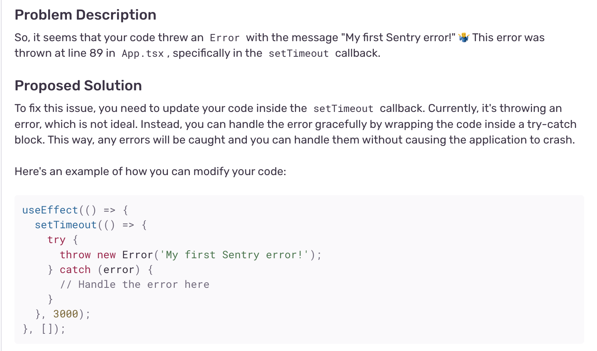
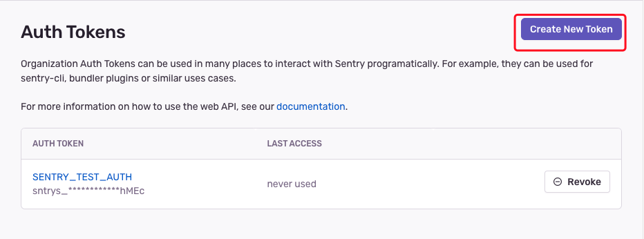

# React Native Sentry错误监控

[github 仓库链接](https://github.com/sRect/reactNativeBlogApp)

本文测试主要版本信息
| package                  | version  |
| ------------------------ | :------: |
| react                    |  18.2.0  |
| react-native             |  0.71.2  |
| @sentry/react-native     |  ^5.10.0 |
| sentry-cli | 2.2.1 |
| android             |  13  |
| 手机             |  小米10  |

## 1. 关于`Sentry`

[`Take action on broken lines of code, crashes, and busted API calls with the only
developer-first app monitoring platform built to give you answers - not clues.`](https://sentry.io/welcome/)

1. `Sentry`可对报错崩溃代码进行监控和上报，并给出解决方案

2. `Sentry`当然不止可以对react native进行错误监控，对于[java、go、nodejs等其它语言](https://sentry.io/platforms/)都可以进行错误监控。本文这里就是针对react native中接入使用sentry了

3. `Sentry`对于[开发者个人使用是免费的，团队使用($26/月)和商业使用($80/月)是收费的](https://sentry.io/pricing/)

4. [支持私服部署](https://develop.sentry.dev/self-hosted/)

## 2. Sentry注册登录

1. 创建组织

我这里已经创建了一个组织`ikun`


2. 创建项目

选择react native，输入项目名，选择相应的团队，点击创建即可


## 3. SDK安装并配置

### 3.1 安装

> https://docs.sentry.io/platforms/react-native/

**注意**：此sdk仅支持react native 0.68以上版本

```
npx @sentry/wizard@latest -s -i reactNative
```

运行后，根据提示，选择相应的监控平台，选择相应的项目等，即可。

运行结果：

```
Running Sentry Wizard...
version: 3.15.0 | sentry-cli version: 1.75.2
Sentry Wizard will help you to configure your project
Thank you for using Sentry :)
no URL provided, fallback to https://sentry.io/
? Select the platforms you like to set up: Android
will not configure ios


Please open
https://sentry.io/account/settings/wizard/xxx/?signup=1&project_platform=react-native
in your browser (if it's not open already)


? Please select your project in Sentry: ikun / react-native2

✓ A compatible version of `react-native` is specified in `package.json`.

✓ Added `@sentry/react-native`
✓ A compatible version of `@sentry/react-native` is specified in `package.json`.
✓ Patched build.gradle file.
✓ Patched ./App.tsx file(s).
✓ Added sentry.properties file to android

To make sure everything is set up correctly, put the following code snippet into your application.
The snippet will create a button that, when tapped, sends a test event to Sentry.

After that check your project issues:
https://ikun.sentry.io/issues/?project=xxx

<Button title='Try!' onPress={ () => { Sentry.captureException(new Error('First error')) }}/>

? Have you successfully sent a test event? (Y/n) 
```

### 3.2 配置

+ `App.tsx`

```javascript
import * as Sentry from "@sentry/react-native";

Sentry.init({
  dsn: "https://xxx.ingest.sentry.io/xxx",
  // Set tracesSampleRate to 1.0 to capture 100% of transactions for performance monitoring.
  // We recommend adjusting this value in production.
  tracesSampleRate: 1.0,
});

...

export default Sentry.wrap(App);
```

### 3.3 初步校验配置结果

```javascript
// js报错
throw new Error('My first Sentry error!');

// 原生报错
Sentry.nativeCrash();
```

#### 3.3.1 js错误

+ 登录后台，可以看到错误详细：


+ 看下错误解决方案

提示用`try-catch`包裹（这个功能不知在实际业务中遇到报错，会不会好用）


#### 3.3.2 native错误

1. `Sentry.nativeCrash`测试api

**注意**：`Sentry.nativeCrash`这个api，只会在release模式(打了生产包)下生效，本地开发debug模式下，是不会上报错误，[Native crashes are not reported #1294](https://github.com/getsentry/sentry-react-native/issues/1294)


+ 登录后台，可以看到错误：

这里也可以看到提示，只在生产模式下生效

+ 点击查看错误详情：


2. java代码错误

在java代码里主动制造一个空指针报错

```java
String str = null;
str.length();
```


错误详情：


跟js错误详情的区别就是，没有展示出来具体代码，但根据报错，也能找到报错的地方

## 4. 手动上传Source Maps源码

> To get unminified stack traces for JavaScript code, source maps must be generated and uploaded.

> The React Native SDK handles source maps automatically for iOS with Xcode and Android with Gradle

要获得JavaScript代码的完整堆栈跟踪，必须生成并上传源映射

不过React Native SDK会自动处理和上传源码及源码映射文件

### 4.1 Using custom Release and Distribution

1. 设置 Release and Distribution

```
# .env
SENTRY_RELEASE=mydeeplink@0.0.1
SENTRY_DIST=1
```

2. 设置禁止自动上传

注释掉之前的代码

```groovy
// android/app/build.gradle
// apply from: "../../node_modules/@sentry/react-native/sentry.gradle"
```

```groovy
// android/build.gradle
buildscript {
    dependencies {
        // Other dependencies ...
        // classpath("io.sentry:sentry-android-gradle-plugin:3.14.0")
    }
}
```

3. App.tsx

```javascript

import Config from 'react-native-config';

Sentry.init({
  // autoInitializeNativeSdk: false,
  dsn: 'https://xxx.ingest.sentry.io/xxx',
  // Set tracesSampleRate to 1.0 to capture 100% of transactions for performance monitoring.
  // We recommend adjusting this value in production.
  tracesSampleRate: 1.0,
  release: Config.SENTRY_RELEASE,
  dist: Config.SENTRY_DIST,
});
```

### 4.2 Preparing Source Maps for a Release

#### 4.2.1 配置 CLI

1. 安装 @sentry/cli

> https://docs.sentry.io/product/cli/installation/

```bash
sudo npm install -g @sentry/cli --unsafe-perm
```

2. 配置sentry-cli

```bash
sentry-cli login
```
此时会打开浏览器



创建好token后一定要复制保存好，点击确定就看不到了，把token复制好后填入下面的命令行中，回车完成


#### 4.2.2 生成bundle和源码映射文件

**注意：**如果使用的`Hermes`引擎，[按着这份文档操作](https://docs.sentry.io/platforms/react-native/manual-setup/hermes/#custom-source-maps)

1. `Bundle/minify with metro (react-native) to get the bundle (.bundle or .jsbundle) and packager source map (.map)`

即使用`metro`生产budle文件

```bash
npx react-native bundle --platform android --dev false --entry-file index.js --reset-cache --bundle-output index.android.bundle --sourcemap-output index.android.bundle.packager.map --minify false
```

2. `Compile to bytecode using hermes to get the compiler source map (.hbc.map)`

即使用`hermes`编译成字节码

+ 低于或等于 React Native 0.68版本：
```bash
node_modules/hermes-engine/{OS-BIN}/hermesc -O -emit-binary -output-source-map -out=index.android.bundle.hbc index.android.bundle

rm -f index.android.bundle

mv index.android.bundle.hbc index.android.bundle
```

+ 大于或等于React Native 0.69版本：

```bash
node_modules/react-native/sdks/hermesc/{OS-BIN}/hermesc -O -emit-binary -output-source-map -out=index.android.bundle.hbc index.android.bundle

rm -f index.android.bundle

mv index.android.bundle.hbc index.android.bundle
```

**注意：**(`OS-BIN`的值为`linux64-bin、osx-bin、win64-bin`，根据自己的操作系统然后进行选择)

3. `Merge the two source maps using compose-source-maps to get the final source map (.map):`

即合并源码文件生成最终文件

```bash
node node_modules/react-native/scripts/compose-source-maps.js index.android.bundle.packager.map index.android.bundle.hbc.map -o index.android.bundle.map
```

生成的文件最终如下：


#### 4.2.3 上传bundle和源码文件

```bash
node_modules/@sentry/cli/bin/sentry-cli releases \
    files <release> \
    upload-sourcemaps \
    --dist <dist> \
    --project <project> \
    index.android.bundle index.android.bundle.map
```

执行命令后，根据提示少什么配置，添加后重新执行即可

上传完成后，可以在后台看到刚上传的文件


#### 4.2.4 报错测试

1. js报错测试


2. 原生报错测试

和上面一样

#### 4.2.5 存在的疑问

手动上传源码映射文件和自动处理现在看来差距不是很大，可能要真实业务代码才能看出来差距

## 5. 容器部署sentry

[self-hosted文档](https://develop.sentry.dev/self-hosted/)

> Our recommendation is to download the latest release of the self-hosted repository, and then run ./install.sh inside this directory. and then will tell you to run docker-compose up -d to start Sentry. Sentry binds to port 9000 by default.

步骤：

1. 服务器上下载[self-hosted](https://github.com/getsentry/self-hosted/releases/tag/23.10.1)源码

2. 解压后，到文件夹内执行`install.sh`脚本

```
sudo ./install.sh 
▶ Parsing command line ...

▶ Detecting Docker platform
Detected Docker platform is linux/amd64

▶ Initializing Docker Compose ...

▶ Setting up error handling ...
Sending build context to Docker daemon  2.048kB
Step 1/4 : FROM debian:bullseye-slim
bullseye-slim: Pulling from library/debian
e67fdae35593: Pulling fs layer
e67fdae35593: Verifying Checksum
e67fdae35593: Download complete
e67fdae35593: Pull complete
Digest: sha256:9bec46ecd98ce4bf8305840b021dda9b3e1f8494a0768c407e2b233180fa1466
Status: Downloaded newer image for debian:bullseye-slim
 ---> 06a976e818e6
Step 2/4 : LABEL MAINTAINER="oss@sentry.io"
 ---> Running in 7d0ca1230bdb
Removing intermediate container 7d0ca1230bdb
 ---> a4943da44980

...

Found Docker version 20.10.21
Found Docker Compose version 2.23.0
Unable to find image 'busybox:latest' locally
latest: Pulling from library/busybox
3f4d90098f5b: Pulling fs layer
3f4d90098f5b: Verifying Checksum
3f4d90098f5b: Download complete
3f4d90098f5b: Pull complete
Digest: sha256:3fbc632167424a6d997e74f52b878d7cc478225cffac6bc977eedfe51c7f4e79
Status: Downloaded newer image for busybox:latest
WARN: Recommended minimum CPU cores available to Docker is 4, found 2
FAIL: Required minimum RAM available to Docker is 3800 MB, found 1976 MB
```

最终提示CPU核数不够，内存不足，屌丝服务器配置不行。。。

3. 启动容器

上面成功后，执行下面命令启动，不出意外就可以通过`http://xxx:9000`访问了，后续可以配置成将错误发送到自己服务器上了。

```sh
docker-compose up -d
```

## 6. 参考资料

1. [sentry文档](https://docs.sentry.io/platforms/react-native/sourcemaps/)